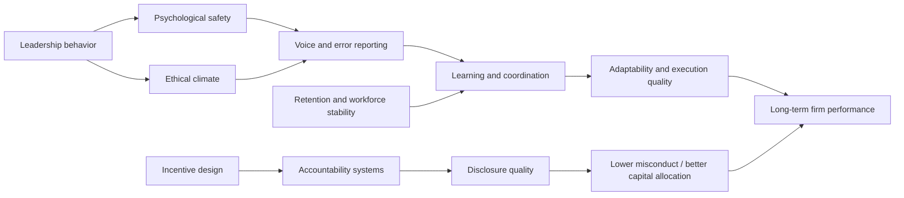
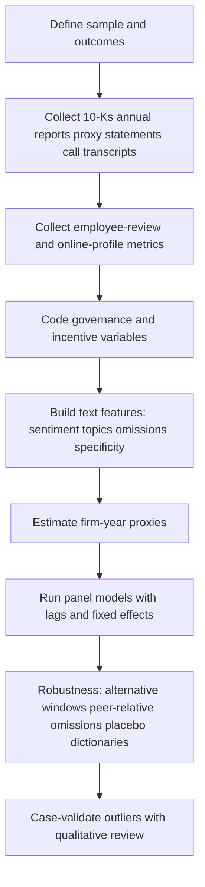

# Soft Leadership, Management Quality, and Long-Term Firm Performance

## Executive summary

The literature is clear on the broad point and murkier on the neat one-liner. “Soft” leadership and management factors do matter for long-run performance, but the strongest evidence usually works through intermediate mechanisms rather than directly through a single headline variable. The most consistently supported channels are ethical/integrity culture, psychological safety and voice, employee satisfaction and retention, structured management practices, and leadership behaviors that either enable or suppress learning and truthful reporting. Across these streams, firms do better over time when employees trust top management, feel able to speak up, stay longer, and operate under coherent systems for monitoring, targets, incentives, and coordination. Conversely, fear, silence, misaligned incentives, and managerial opacity are repeatedly associated with poorer adaptability, lower future profitability, weaker innovation, misconduct, and slower organizational learning. citeturn18search4turn2search4turn1search1turn6view0turn16search4turn6view4

For company-level research, the right move is not to hunt for a magical proxy. There isn’t one. Structural governance variables such as CEO duality or board composition are useful controls, but they are weak direct measures of lived culture; they are, at best, distant shadows on the cave wall. Employee-facing signals and disclosure behavior tend to be more informative: Glassdoor ratings and review text, online-profile-derived turnover, executive tenure patterns, compensation design, workforce-stability disclosures, legal proceedings, whistleblower-related revelations, and the specificity versus vagueness of human-capital language in annual reports and earnings calls. citeturn17search12turn6view0turn3search2turn18search4turn6view7turn8view0

The most defensible empirical design is therefore a triangulated one: combine public people data, governance structure, compensation architecture, and textual measures from filings and calls; lag the soft-factor proxies; and then test links to multi-year performance, survival, innovation, misstatements, recalls, enforcement actions, or other forward outcomes. That approach also avoids the classic tautology trap in capability and culture research, where the “good culture” variable quietly becomes a relabeled performance measure. citeturn16search1turn16search4turn6view0turn18search6turn6view7

## What the literature actually supports

A useful way to organize the evidence is to separate soft factors into a few constructs that recur across peer-reviewed literatures. The table below highlights the ones with the strongest empirical backing and the most usable public proxies.

| Soft factor | What the literature most strongly supports | Likely performance channel | Best public starting proxies | What to be careful about |
|---|---|---|---|---|
| Integrity and ethical culture | Employees’ perception that top managers are trustworthy and ethical is associated with stronger firm performance; merely proclaimed values are much less informative. citeturn18search4turn18search6 | Lower misconduct, better coordination, less short-termism, better disclosure quality | Review-platform text on ethics/integrity/senior management; litigation/enforcement; restatements; proxy disclosures on clawbacks and conduct oversight | Mission statements are cheap; lived norms matter more than slogans. citeturn6view2turn9search5 |
| Psychological safety and voice climate | Meta-analytic evidence shows psychological safety explains unique variance in task performance and citizenship behavior, and review work links voice/silence to important organizational implications. citeturn2search4turn4search0turn4search20 | Better error reporting, faster learning, more adaptation, less silence | Earnings-call language around listening, learning, retaliation, speaking up; employee review text; safety hotlines or ombuds disclosures; scandal histories | Psychological safety is difficult to infer from one source; use multiple indicators. |
| Employee satisfaction, retention, and workforce stability | Employee satisfaction predicts long-run stock returns; turnover extracted from workers’ online profiles predicts lower future ROA and sales growth when high. citeturn1search1turn6view0 | Human-capital preservation, tacit knowledge retention, customer continuity | Glassdoor ratings/review text; online-profile attrition and tenure; disclosed turnover or retention metrics | Some turnover is healthy; the relation is nonlinear. citeturn6view0 |
| Structured management and accountability practices | Better management practices are strongly associated with higher productivity, profitability, Tobin’s Q, sales growth, and survival; these measures include monitoring, target setting, and incentives. citeturn16search1turn16search4turn16search18 | Higher execution quality, better resource allocation, clearer accountability | Proxy-statement compensation design; executive succession depth; operating-rhythm language in calls; board risk-oversight architecture | “Accountability” in research is usually decomposed into targets, monitoring, consequences, and truthful reporting rather than a single stand-alone variable. |
| Supportive versus destructive leadership | Ethical and servant leadership meta-analyses find broad positive work outcomes; destructive leadership evidence is strongest for silence, fear, and coordination failures, with vivid process evidence in cases such as Nokia. citeturn2search6turn3search1turn6view4 | More or less learning, candor, initiative, cross-functional cooperation | Review text on senior management; executive turnover clusters; abrupt strategic reversals; post-scandal board and management changes | Direct firm-level causal inference is harder than at the team level. |
| Governance structure | Governance structure matters, but recent reviews find no systematic CEO-duality/performance relationship; traditional governance variables often explain much less than lived integrity culture. citeturn3search2turn18search4 | Moderation rather than direct culture measurement | CEO duality, board independence, board turnover, committee memberships, leadership structure | Useful as controls and moderators; weak as stand-alone culture measures. |

Two literature points are worth making explicit. First, the best-supported “soft” variables are not fluffy in a mystical sense; they are organizational conditions that shape information flow, truthfulness, learning, and labor stability. Second, direct research on “accountability” as a single construct is comparatively fragmented. In top-tier empirical work it is more often operationalized through management systems, incentive alignment, conduct oversight, adverse-event learning, and truthful disclosure than through a clean accountability scale. That is inconvenient, but also helpful: it gives you observable subcomponents. citeturn16search1turn16search18turn6view2turn8view0

The finance and strategy literature is especially useful here because it gives a blunt corrective to governance reductionism. Guiso, Sapienza, and Zingales find that proclaimed values are largely irrelevant, while employee perceptions of trustworthy and ethical top managers are what matter for performance; a more recent executive survey by Graham, Grennan, Harvey, and Rajgopal finds overwhelming executive agreement that culture affects value creation, ethical choices, and innovation, with inattentive leaders and misaligned incentives among the main obstacles. In other words: if a firm’s annual report sounds like an ethics poster from the break room but says little about actual workforce systems, treat it as theater until proven otherwise. citeturn18search4turn18search6turn6view2

## Public proxies you can actually observe

For public-company research, filings and public labor-market traces are the main raw material. Since the 2020 amendments adopted by the entity["organization","U.S. Securities and Exchange Commission","us regulator"], Item 101(c) requires a principles-based description of human capital resources and any material human-capital measures or objectives management focuses on, with attraction, development, and retention explicitly given as examples. The same rulemaking also acknowledges that a more principles-based framework improves tailoring but can reduce comparability across firms. The SEC’s 2023 Investor Advisory Committee recommendation is even more direct: current human-capital disclosure remains inconsistent, hard to verify, and weakly comparable, and investors still want baseline items such as worker-type breakdowns and turnover or workforce-stability metrics. citeturn6view7turn8view0

That has a practical implication for your project: omission is informative only relative to peers, prior years, and regulatory baselines. A company’s failure to disclose turnover is not, by itself, a smoking gun, because the rule is principles-based. But failure to disclose any workforce-stability, development, speaking-up, or contingent-labor information in an industry where close peers do so routinely can be used as a peer-relative omission indicator. That should be framed as an inference about transparency and possible managerial priorities, not as proof of a bad culture. citeturn6view7turn8view0

### Proxy comparison

| Proxy family | Where to get it | What it may capture | Strengths | Main limitations |
|---|---|---|---|---|
| Employee review platforms | Glassdoor ratings, CEO approval, “recommend to a friend,” review text | Employee satisfaction, perceived quality of senior management, ethics, workload, voice, career prospects | Forward-looking signal; changes in crowdsourced employer ratings predict future stock returns, especially for current employees and senior-management/career-opportunity dimensions. citeturn17search12turn17search5 | Selection bias, review gaming risk, occupation skew, cross-country coverage differences |
| Online profile–based turnover and tenure | LinkedIn-style public job histories or commercial datasets built from them | Workforce churn, tenure stability, internal mobility, leadership churn | Peer-reviewed evidence shows turnover extracted from employees’ online profiles is negatively associated with future ROA and sales growth. citeturn6view0 | Coverage is uneven and likely tilted toward digitally active white-collar workers |
| 10-K human-capital disclosure | Annual reports / Form 10-K Item 101(c) | Management salience of retention, development, labor structure, safety, DEI, training, contingent labor | Official, audited filing context, long panel availability | Because the rule is principles-based, silence may reflect discretion rather than underlying weakness. citeturn6view7turn8view0 |
| Proxy statements | DEF 14A / Schedule 14A | Board oversight, CEO duality, committee structure, succession, incentive design, pay ratio, pay-versus-performance, clawbacks | Rich governance and incentive data; standardized enough for coding | Structural proxies are coarse; they do not directly observe daily managerial behavior. citeturn14search1turn14search4turn9search5turn9search8turn3search2 |
| Executive and board tenure | Proxy statements, annual reports, investor decks | Stability, internal succession strength, accountability resets, concentration of power | Easy to collect and objective | High or low tenure can each be good or bad depending on context |
| Litigation, enforcement, whistleblower-related events | Legal proceedings in filings, regulator releases, court documents | Integrity failures, retaliation climate, weak controls, toxic incentives | Hard public events; high signal when present | Sparse and right-tail only; mostly captures failure, not healthy firms |
| Earnings calls and letter-to-shareholders text | Call transcripts, annual-report letters, investor presentations | Tone, specificity, blame-shifting, talent salience, learning orientation, strategic candor | Scalable and timely | Tone is noisy; boilerplate can swamp substance unless you model specificity and omissions |
| Voluntary survey metrics | Sustainability reports, HCM reports, websites | Engagement, training, internal mobility, inclusion, safety climate | More direct than pure text if disclosed | Often incomparable and selectively disclosed |

The most informative public indicators for healthy soft-factor states tend to look boring in the best possible way: specific retention or internal-mobility metrics; stable but not stagnant executive tenure; explicit discussion of nonfinancial incentives and conduct oversight; disclosure of contingent labor and workforce mix; evidence of board-level risk and people oversight; and language that connects culture to operating systems rather than to abstract virtue. The riskier patterns are the mirror image: sudden moral grandstanding after scandal, KPI-heavy compensation without countervailing conduct metrics, repeated reorganizations, clusters of senior exits, euphemistic “talent optimization” language during integrity failures, and workforce sections that sound as though an attorney and a fog machine collaborated on them. citeturn18search4turn6view2turn6view7turn8view0

Governance variables deserve special treatment. Board independence, board composition, and CEO duality belong in the model, but mostly as controls, moderators, or instruments of organizational architecture. A recent systematic review finds no systematic CEO-duality/performance relationship, and Guiso et al. find traditional governance measures do not do much to sustain integrity compared with lived managerial trustworthiness. So code them, yes; worship them, no. CEO duality is a structural fact, not a culture MRI. citeturn3search2turn18search4

Proxy statements are still highly valuable because they reveal incentive architecture. In U.S. filings, you can observe pay ratio disclosure, pay-versus-performance disclosure, and clawback policy requirements under SEC rules, alongside board leadership structure, committee assignments, succession planning, and narrative discussion of risk oversight. These are not direct culture measures, but they are strong observable inputs into accountability and conduct-risk systems. citeturn14search1turn14search4turn14search15turn9search5turn9search8

## Textual analysis methods that are worth using

Text analysis is especially useful for this topic because executives rarely file a form called “Here is our fear-based culture.” The core methods are complementary rather than substitutive. Dictionary methods are good for transparency and replication; supervised models are better for construct validity when you have labels; topic models are useful for discovering what the firm emphasizes or avoids; sentiment works best with domain-specific lexicons; omission detection is promising but should be treated as relative, not absolute. citeturn15search0turn15search1turn15search2turn15search3

The strongest recommendation for a filings-based project is a layered pipeline. Start with a finance-specific dictionary for baseline sentiment and uncertainty because generic sentiment dictionaries notoriously misclassify finance terms such as “liability.” Then add a culture-specific measurement layer using either a dictionary or a supervised model trained on labeled sentences or reviews. Li, Mai, Shen, and Yan show how earnings calls can be used to score values such as innovation, integrity, quality, respect, and teamwork at scale; topic-model work on MD&A shows you can also extract topic prevalence and topic sentiment over time. citeturn15search0turn6view1turn15search2turn15search19

For omission detection, the most defensible academic implementation is not “the model says this sentence is missing, therefore the company is bad.” It is to build an expected-disclosure benchmark from the firm’s own prior disclosures and same-industry, same-year peers, then estimate abnormal absence of workforce-stability, conduct-risk, contingent-labor, safety, or development topics. NLP work has shown omitted risk-factor detection is technically feasible, but the measurement is still less mature than sentiment or topic prevalence. In this area, peer-relative abnormal silence is better than absolute moral certainty. citeturn15search3turn6view7turn8view0

### Method comparison

| Method | Best use | Strengths | Weaknesses | Recommended tools |
|---|---|---|---|---|
| Dictionary scoring | Baseline tone, uncertainty, integrity/workforce dictionaries | Transparent, fast, easy to replicate | Can miss context and sarcasm; construct validity depends on lexicon | Python: `pandas`, `spaCy`, custom lexicons; R: `quanteda`, `tidytext` citeturn15search0turn6view1 |
| Supervised ML | Classifying sentences into leadership/culture constructs | Better construct validity if labels are good | Requires labeled data; drift over time | Python: `scikit-learn`, `transformers`, `sentence-transformers`; R: `text2vec`, `torch` citeturn15search1turn15search10 |
| Topic modeling | Identifying workforce/culture themes and their salience | Good for discovery and omission benchmarking | Topics can be unstable and vague if preprocessing is weak | Python: `gensim`, `BERTopic`; R: `stm`, `quanteda.textmodels` citeturn15search2turn15search19 |
| Sentiment | Year-over-year candor/blame/optimism shifts | Easy panel construction | Generic sentiment performs poorly in financial text | Use finance-specific lexicons first, then domain tuning citeturn15search0 |
| Omission detection | Relative absence of expected people-risk disclosures | Directly relevant to selective transparency | Validation is still developing | Peer-year benchmark + sentence classification + abnormal residuals citeturn15search3turn8view0 |

A practical Python baseline is below. It is intentionally simple: pull filings, isolate target sections, and compute transparent dictionary scores before adding more elaborate models. The logic is conservative: start with replicable metrics, then graduate to transformer wizardry only if the data justify it. citeturn15search0turn6view7

```python
from pathlib import Path
import re
import pandas as pd
from bs4 import BeautifulSoup
from collections import Counter

# pip install sec-edgar-downloader beautifulsoup4 lxml pandas
from sec_edgar_downloader import Downloader

DATA = Path("edgar_data")
dl = Downloader(str(DATA))

# Example: 10-K and proxy statement
ticker = "MSFT"
dl.get("10-K", ticker, limit=3)
dl.get("DEF 14A", ticker, limit=3)

def read_filing_text(path: Path) -> str:
    raw = path.read_text(errors="ignore")
    soup = BeautifulSoup(raw, "lxml")
    text = soup.get_text(" ")
    text = re.sub(r"\s+", " ", text)
    return text.lower()

def simple_section(text: str, start_pat: str, end_pat: str | None = None) -> str:
    m1 = re.search(start_pat, text, flags=re.I)
    if not m1:
        return ""
    start = m1.start()
    end = len(text)
    if end_pat:
        m2 = re.search(end_pat, text[start + 1:], flags=re.I)
        if m2:
            end = start + 1 + m2.start()
    return text[start:end]

# Replace with domain-specific dictionaries.
integrity_words = {"integrity", "ethics", "speak up", "retaliation", "hotline", "misconduct", "compliance"}
retention_words = {"retention", "turnover", "attrition", "tenure", "engagement", "internal mobility", "training"}

rows = []
for filing in DATA.rglob("*.txt"):
    txt = read_filing_text(filing)
    item101 = simple_section(txt, r"item\s+1\.", r"item\s+1a\.")  # rough proxy for business/human capital area
    c = Counter(item101.split())
    rows.append({
        "file": filing.name,
        "integrity_count": sum(1 for w in integrity_words if w in item101),
        "retention_count": sum(1 for w in retention_words if w in item101),
        "word_count": len(item101.split())
    })

df = pd.DataFrame(rows)
df["integrity_rate"] = 1000 * df["integrity_count"] / df["word_count"].clip(lower=1)
df["retention_rate"] = 1000 * df["retention_count"] / df["word_count"].clip(lower=1)
print(df.sort_values("file"))
```

In R, `quanteda` plus `stm` is a very efficient combination for company-year topic prevalence and comparative omission work. The pattern below lets you estimate whether workforce-related topics are abnormally underdisclosed relative to industry-year peers. citeturn15search2turn15search19turn8view0

```r
# install.packages(c("quanteda", "stm", "dplyr", "readr"))
library(quanteda)
library(stm)
library(dplyr)
library(readr)

docs <- read_csv("firm_year_text.csv")  # columns: firm, year, industry, text

corp <- corpus(docs, text_field = "text")
toks <- corp |>
  tokens(remove_punct = TRUE, remove_numbers = TRUE) |>
  tokens_remove(stopwords("en")) |>
  tokens_wordstem()

dfm_mat <- dfm(toks) |>
  dfm_trim(min_termfreq = 20, min_docfreq = 0.02)

stm_input <- convert(dfm_mat, to = "stm")
meta <- docs |> select(firm, year, industry)

mod <- stm(
  documents = stm_input$documents,
  vocab = stm_input$vocab,
  K = 20,
  prevalence = ~ s(year) + industry,
  data = meta,
  init.type = "Spectral"
)

theta <- as.data.frame(mod$theta)
theta$firm <- meta$firm
theta$year <- meta$year
theta$industry <- meta$industry

# Example: calculate peer-relative topic residual for a topic believed to capture workforce stability
topic_id <- 7
theta <- theta |>
  group_by(industry, year) |>
  mutate(abnormal_topic = .data[[topic_id]] - mean(.data[[topic_id]], na.rm = TRUE)) |>
  ungroup()

write_csv(theta, "topic_prevalence_with_peer_residuals.csv")
```

## Case mapping

Nokia is the cleanest academic illustration of why soft factors matter for adaptability. Vuori and Huy’s qualitative study of the 2005–2010 smartphone period finds that top and middle managers’ shared emotions, especially fear, created behavior cycles that damaged the innovation process and its outcome. The importance of that case is not just “fear is bad.” It is that external pressure translated into internal emotional dynamics that distorted information flow upward and candid assessment downward, weakening adaptive response in a fast-moving market. For your framework, Nokia maps directly onto psychological safety, voice, adversarial internal dynamics, and strategic attention failure. Public proxies that would have been usable in real time are harder than in U.S. filing-based cases, but earnings-call tone, executive exits, strategic reversals, and retrospective disclosure inconsistency all fit the mechanism. citeturn6view4

entity["company","Wells Fargo","bank"] is the archetypal public-proxy case for accountability and incentive misalignment. Its 2017 proxy statement explicitly described cultural remediation steps that began with governance and incentive redesign: separating chair and CEO roles, enhancing board oversight of conduct risk, creating an Office of Ethics, Integrity, and Oversight, and eliminating retail product sales goals. At the same time, later SEC enforcement documented misleading public statements and certifications regarding the cross-sell metric, and the SEC’s 2020 order noted remedial actions including terminating employees, replacing most of the senior operating committee, reconstituting the board, and centralizing control functions. The same proxy process also examined EthicsLine and HR data in connection with employees who reported misconduct and then faced corrective action, giving a concrete example of how whistleblower review, retaliation risk, incentive design, and board response become observable public variables. citeturn12view1turn12view0turn12view2turn12view3

entity["company","Boeing","aerospace company"] is the clearest recent public case for reporting culture and psychological safety in a safety-critical setting. The expert-panel report published through the entity["organization","Federal Aviation Administration","us aviation regulator"] states that positive safety culture depends on reporting, just, flexible, learning, and informed culture; it also notes that Boeing documentation, surveys, and employee interviews did not provide objective evidence of a foundational commitment to safety matching the company’s own descriptions. The panel further found employee confusion about safety-culture terminology, limited translation of top-level SMS documents into worker-level understanding, and insufficient employee awareness of their role in the system; FAA testimony later emphasized the need for a culture where people raise safety concerns without fear of reprisal. This is exactly the sort of case where public indicators such as non-punitive reporting commitments, safety metrics, independent reviews, and enforcement-driven remediation map to soft-factor theory. citeturn11view0turn10search15turn10search2turn10search16

### How the cases map to observable indicators

| Case | Soft-factor issue | Observable public indicators | Outcome |
|---|---|---|---|
| Nokia | Fear, suppressed candor, maladaptive attention | Executive conflict signals, strategic reversals, tone shifts, delayed acknowledgment of platform risk | Reduced adaptability in the smartphone transition. citeturn6view4 |
| Wells Fargo | Misaligned incentives, weak accountability, disclosure integrity failure | Sales-goal architecture, conduct-risk oversight, KPI rhetoric, whistleblower/ethics-line review, board restructuring | Misconduct, enforcement, stock-value loss, costly remediation. citeturn12view1turn12view0turn12view3 |
| Boeing | Weak reporting culture, poor safety-system translation, insufficient safety commitment | Safety-culture language, independent panel findings, corrective-action roadmaps, reporting-culture commitments | Quality and safety failures, intensified oversight, long remediation cycle. citeturn11view0turn10search2turn10search15 |

## Research design for a sample of firms

The most credible design is a multi-source panel with lagged soft-factor measures and forward performance outcomes. I would recommend a firm-year panel of publicly listed firms, with four proxy blocks: public employee sentiment, workforce stability, governance/incentive structure, and disclosure text. Keep the constructs separate at first; only build a composite latent factor after inspecting intercorrelations and measurement quality. That lets you test whether “soft-factor health” is really one dimension or several loosely related ones. citeturn17search12turn6view0turn3search2turn6view7turn18search4

The basic causal story, as a literature synthesis, looks like this:



This diagram synthesizes the mechanisms repeatedly emphasized in the literature: leadership and incentives shape safety, ethics, and accountability; those shape voice, retention, learning, and disclosure; and those, in turn, shape long-run outcomes. citeturn2search4turn18search4turn6view2turn6view0turn16search1

For dependent variables, use at least one accounting measure, one market measure, and one downside-risk or failure measure. A good baseline set is one- to three-year-ahead ROA, sales growth, Tobin’s Q or market-to-book, and a negative-outcome panel that includes major enforcement events, restatements, recalls, or severe litigation. That matches the literature better than relying on one headline stock-return variable. citeturn1search1turn6view0turn16search4

For controls, include firm size, age, leverage, industry, country, labor intensity, prior performance, R&D intensity, acquisition activity, CEO turnover, and year fixed effects; then add firm fixed effects in the panel models. If you use employee-review data, include review count thresholds and separate current-employee from former-employee signals. If you use online-profile turnover, test nonlinear effects because very low turnover is not uniformly optimal. citeturn6view0turn17search12

A practical sequence is:



That sequence matters because it forces separation between measurement and interpretation. Build the proxies first, estimate the models second, and only then read the outliers qualitatively. Otherwise the research becomes a very elegant way of confirming what you already think. Academia has enough of those already. citeturn16search15turn15search0turn15search3turn6view7

For robustness checks, I would prioritize five. First, use multiple performance horizons and lag structures. Second, compare a “hard structure only” model against a “people and text” model to show incremental explanatory power. Third, re-estimate with peer-relative disclosure residuals rather than raw topic frequencies. Fourth, exclude firms in immediate scandal windows to avoid reverse causality dominating the soft-factor measures. Fifth, use a case-validation pass on the most extreme observations to confirm that high or low scores correspond to recognizable organizational realities. citeturn18search4turn17search12turn6view0turn15search3

## Practical checklist

If you want a compact operational checklist for firm-level research on these soft factors, use this:

- Define the construct family first: integrity culture, psychological safety/voice, workforce stability, accountability systems, or destructive/supportive leadership. Do not begin with a random buffet of public variables.
- Treat structural governance variables as controls or moderators, not as direct measures of culture. CEO duality and board composition are useful, but weak stand-alone proxies. citeturn3search2turn18search4
- Build at least one proxy from each of four domains: employee sentiment, labor-market stability, governance/incentive design, and disclosure text.
- In annual reports and 10-Ks, code not only presence of human-capital language but specificity: actual metrics, workforce breakdowns, contingent labor, turnover/retention, training, internal mobility, safety reporting, and conduct mechanisms. Compare against same-industry peers because SEC disclosure is principles-based. citeturn6view7turn8view0
- In proxy statements, code board leadership structure, executive tenure, committee design, conduct-risk oversight, long-term versus short-term incentives, pay ratio, pay-versus-performance, and clawback architecture. citeturn14search1turn9search5turn9search8
- Use Glassdoor review text and ratings as a meaningful but imperfect signal; separate current and former employees where possible, and require a minimum review count. citeturn17search12turn17search5
- Use online-profile turnover or tenure panels as a second people signal; test nonlinear effects and occupation-coverage sensitivity. citeturn6view0
- Build text features in layers: finance-specific dictionary first, topic prevalence second, supervised culture classification third, omission scores last. citeturn15search0turn15search1turn15search2turn15search3
- Lag all soft-factor measures and test multi-year outcomes.
- Validate extreme cases qualitatively. Nokia, Wells Fargo, and Boeing show that the best proxies are the ones that map to actual organizational mechanisms, not to generic “good governance” checklists. citeturn6view4turn12view1turn11view0

The bottom line is that publicly observable “soft value state” is inferable, but only probabilistically and only through triangulation. Annual reports, proxy statements, calls, employee-review datasets, turnover traces, tenure patterns, and enforcement signals each capture a slice of the underlying system. Used together, they can support serious company-level research on accountability, retention, culture, psychological safety, and adversarial leadership. Used alone, they mostly support confident overstatement. The literature rewards the former and usually punishes the latter, though not always quickly enough. citeturn18search4turn6view2turn6view0turn6view7turn8view0